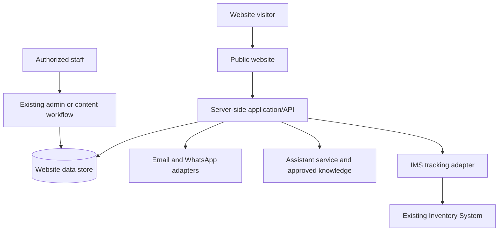

# A.A.U. Chamo Website and Customer Enquiry Platform
## Expanded Implementation PRD and Technical Specification

**Prepared for:** A.A.U. Chamo Management  
**Prepared by:** Nillar Softwares  
**Source baseline:** Updated Project Agreement and Requirements Document (14 calendar days; ₦1,500,000)  
**Purpose:** Complete the existing project to the agreed scope, while preserving verified working features and closing implementation, integration, testing and handover gaps.

> **Important scope rule:** This project is already underway or has existing features. Start with an evidence-based audit of the current website, repository, deployment, database and integrations. Do not rebuild working features. Record each requirement as **Existing and verified**, **Incomplete**, **Defective**, **Missing**, or **Deferred by agreement**. Complete the agreed deliverables within the existing project scope where practical; treat new work beyond the agreement as a separately approved change.

## 1. Product vision

The website is A.A.U. Chamo’s public digital platform for explaining services and converting visitors into structured enquiries and customer conversations. It must support flight, cargo, courier, visa, travel, Umrah/Ziyara and business-service enquiries; provide AI-assisted service guidance; connect users to official human support; and expose cargo tracking when a secure IMS integration is available.

The first release is an **enquiry and assistance platform**, not an automated travel booking engine or replacement for the existing Inventory Management System. A submitted form or AI-assisted request is not a confirmed booking. Confirmation must come from an authorized staff member or an approved connected system.

## 2. Objectives and success measures

| Objective | Success measure |
|---|---|
| Present a trusted company profile | Approved pages and contact information are complete, accurate and accessible on mobile/desktop |
| Generate actionable leads | Every in-scope form stores a valid request, creates a reference and routes notifications |
| Improve customer response | Customer acknowledgement and department notification are tested; failures are visible to staff |
| Provide consistent first-line assistance | AI answers only from approved material and can collect a structured draft/request with customer consent |
| Make human help immediate | WhatsApp buttons reach the official account and safely include a reference when available |
| Enable cargo visibility | Tracking UI works; live data is shown only through an approved IMS connection, otherwise the site clearly offers the agreed interim path |
| Complete and hand over the project | Production deployment, analytics/SEO setup, training, credentials ownership and technical runbook are delivered |

Do not define conversion or response-rate targets until baseline traffic and operational response capacity are known. Instrument relevant events without collecting personal information in analytics.

## 3. Scope agreed for this phase

### 3.1 Included

- Public responsive website: Home, About, Services, Cargo & Logistics, Flight & Travel, Umrah & Ziyara, News & Updates, Gallery, Track Cargo and Contact Us.
- Dedicated pages for Flight Reservation & Ticketing; Air Cargo & Logistics; Courier & Delivery; Clearing & Forwarding; Visa Assistance; Travel Insurance; Baggage Handling; Umrah & Ziyara; International Business & Trade Services.
- Structured enquiry/booking-request forms, unique references, secure persistence, acknowledgement email and department notification, and a staff follow-up mechanism using an existing admin feature or a lightweight agreed mechanism.
- Official WhatsApp links and handoff flow.
- AI customer-assistant MVP grounded in approved company content, with structured enquiry capture, consent and human escalation.
- Cargo-tracking interface, plus live IMS integration only if an authorized, documented and testable API is available within the agreed period. Otherwise, implement and document the integration-ready boundary and customer-safe interim messaging.
- News and gallery publishing through existing CMS/admin where available. If no CMS exists, agree on a practical content-management method that does not silently expand into a full custom admin dashboard.
- Mobile-first implementation, HTTPS/SSL, spam protection, SEO foundation, analytics and Search Console setup, deployment, staff orientation, handover documentation and one month of post-launch bug support.

### 3.2 Explicitly deferred by the agreement

Full customer portal/login; online payments; customer shipment history; full admin dashboard; invoices and receipts; native mobile app; advanced reports; complete IMS integration where API/access is unavailable; real-time flight availability/ticket issuance; automated cargo prices; automated booking confirmation; automated SMS; multi-branch operations platform. These require separate scope, timeline, cost and approval unless already present and simply need verification/configuration.

## 4. Existing-project completion workflow

### 4.1 Baseline audit (first working session)

Inspect and document:

| Area | Checks | Evidence to retain |
|---|---|---|
| Live website | Routes, responsive layouts, links, forms, content, SEO, SSL, broken states | Route inventory and desktop/mobile screenshots or test log |
| Source/repository | Framework and version, active branch, build, lint/type checks, tests, dependencies, deploy config | Baseline commit, successful/failed build log, architecture note |
| Existing features | Which deliverables are done, partial, broken or absent | Traceability matrix with owner and corrective action |
| Database/forms | Data model, persistence, duplicate handling, migrations, backups, access | Schema summary, backup timestamp and restore procedure |
| Email/WhatsApp | Provider, sender verification, routing, templates, official number | Test evidence without credentials in document |
| AI | Provider/model, prompt, knowledge source, tools, safeguards, logs, cost limits | AI flow diagram and test results |
| IMS | API/interface owner, auth, sandbox, status codes, limits, customer-safe fields | Written integration contract or documented blocker |
| Hosting/analytics | Host, domain/DNS, SSL renewal, analytics, Search Console, logs | Access ownership, deploy/rollback and monitoring note |

Never paste credentials, API keys or customer data into this PRD or its handover. Keep secrets in an approved secret store and share access through a secure method.

### 4.2 Completion register

Create a row for every requirement using columns: `ID | Requirement | Current state | Evidence | Gap/action | Owner | Dependency | Acceptance test | Status`. This register is the working scope control. Any new requirement not present in the signed agreement or approved register requires written change approval, including impact on the 14-day schedule and ₦1,500,000 fee.

## 5. Sitemap and page specifications

| Page | Required content and behavior |
|---|---|
| Home | Clear company proposition; key services; cargo highlight; flight/travel, courier, visa, Umrah and insurance highlights; verified destinations/routes only; why A.A.U. Chamo; track cargo; Book/Enquire CTAs; WhatsApp; AI assistant; approved contact/social footer |
| About Us | Company profile/history, mission, vision, values, management (approved biographies), branches/stations, partnerships, certifications/accreditations, reasons to choose; no unverified claims |
| Services index | Scannable service cards, short descriptions, service-specific CTAs and contact routes |
| Service detail pages | Description, benefits, process, approved FAQs, relevant requirements/disclaimers, enquire/book CTA, WhatsApp CTA |
| Cargo & Logistics | Airport-to-airport, door-to-airport, airport-to-door, local/nationwide delivery, interstate air logistics, consolidation/handling, verified destinations, quotation/enquiry form, tracking entry |
| Flight & Travel | Flight request guidance and form; make clear that schedules, fare and seats are subject to staff/provider confirmation |
| Umrah & Ziyara | Approved programme/package information and request form; no unpublished prices/inclusions/guarantees |
| News & Updates | List/detail views, publish dates, categories, share metadata and editable content by authorized staff |
| Gallery | Categorized images: airport/cargo operations, staff, training, Umrah, international/company events, offices and business activities; captions, alt text and usage permission |
| Track Cargo | Tracking number input, input validation, customer-safe status/timestamp display, neutral not-found/unavailable state, support path |
| Contact Us | Head office and branch details, approved phones/emails/WhatsApp, hours, map, social links, general enquiry form |

Each page must have a clear title, one primary heading, sensible internal links, mobile layout, keyboard access, metadata and non-empty meaningful content. Empty or unapproved pages should be hidden or explicitly marked as not yet available rather than filled with fabricated company data.

## 6. User journeys

### 6.1 Enquiry journey

1. Visitor selects a service or asks the AI assistant.
2. Site explains what information is needed and that submission is a request.
3. Visitor completes a service-specific form; field errors are shown accessibly.
4. Server validates, spam-checks and stores the request once.
5. Server creates a unique reference and queues customer/staff notifications.
6. Success screen displays reference and next steps only after durable storage succeeds.
7. Staff reviews the request in the existing approved workflow, contacts the customer and updates status.

### 6.2 AI-assisted enquiry

AI gives grounded service guidance → asks only for fields needed for selected request → presents a review summary → customer explicitly consents to submit → shared enquiry service stores and routes it → AI shows reference. If submission fails, the AI must say it was not submitted and offer the form/WhatsApp path. AI must not tell the customer they have a confirmed booking.

### 6.3 Cargo tracking

Customer enters tracking number → server validates and rate-limits → approved adapter requests only that shipment → response is mapped to approved public fields → page displays status and last update or a neutral unavailable message. Never return raw IMS records or internal notes.

## 7. Functional and technical requirements

### 7.1 Forms and enquiry processing

Common fields: service type, full name, phone, email where required, preferred contact method, request details, privacy acknowledgement, and anti-spam signal. Collect only information needed to respond. Avoid requesting passport scans, payment card data or other high-risk personal data through basic public forms.

| Request type | Required business fields (confirm exact requiredness with A.A.U. Chamo) |
|---|---|
| Flight | Departure, destination, travel date, passenger count, contact details, relevant requirements; return details where applicable |
| Cargo | Sender/receiver contact or approved minimum contact details, origin/destination, cargo type, weight, preferred date, delivery option; dimensions/quantity if operationally necessary |
| Courier | Pickup/delivery locality, package description/size, preferred date and contact |
| Umrah/Ziyara | Traveller count, preferred period/package interest, contact, optional accessibility needs |
| Visa | Destination, purpose, approximate travel date, contact; nationality only if necessary for guidance |
| Travel | Service type, destination, date, requirements and contact |
| General | Name, contact, subject, message |

Server-side controls:

- Validate field types, allowed service values, lengths, dates, phone/email and payload size. Never rely on browser-only validation.
- Store using a database transaction or equivalent durable write before showing success.
- Generate a unique, non-sequential reference such as `CHM-YYMM-<random>`; do not embed personal data. Ensure database uniqueness and safe collision retry.
- Use an idempotency token or duplicate-submit guard so refresh/retry does not create multiple requests.
- Apply IP/session rate limits, honeypot or equivalent anti-spam, and a CAPTCHA only if needed; provide an accessible alternative.
- Escape user content in staff views and emails. Limit attachment capability to explicitly approved cases.
- Store source channel (web/assistant), consent version/time, created/updated timestamps, assigned department, status and notification delivery state.

Suggested request states: `New → In Review → Awaiting Customer → Confirmed → Completed` and `Cancelled`. Restrict valid transitions and authorized roles. `Confirmed` requires a staff/system actor, confirmation timestamp and confirmation source. Status history must be append-only or otherwise auditable. Never expose internal notes to customers.

**Acceptance checks:** valid form produces one persisted request, unique reference, acknowledgement and correct department email; invalid form returns field-level errors; retries do not duplicate; database/provider failure does not falsely show success; failed email is retried or flagged while request remains available to staff; unauthorized status changes are rejected and logged.

### 7.2 Department routing and email

Maintain a configuration map from request category to approved department recipient(s), with a default customer-service route. Avoid recipient addresses hard-coded across components. Confirm actual addresses and ownership during discovery.

Email templates:

| Template | Minimum content |
|---|---|
| Customer acknowledgement | Company identity, reference, request summary with minimal PII, expected next step, contact path, statement that this is not booking confirmation |
| Staff notification | Reference, service category, submitted fields needed to respond, admin link where available, urgency/date, correlation ID |
| Customer status update | Reference, customer-visible status and next step, support route; omit private staff notes |

Use an approved email provider/domain; verify SPF, DKIM and DMARC where sender domain is controlled. Queue/retry transient failure with bounded backoff; record delivery state. Do not let model-generated text choose arbitrary recipients. Do not put full sensitive details in the email subject line.

### 7.3 WhatsApp integration

- Use only the official A.A.U. Chamo WhatsApp Business destination approved by management.
- Place a floating support button and contextual service-page CTAs; ensure they do not cover form controls on mobile.
- Use click-to-chat with short prefilled text. Include a reference if created. Do not include identity, cargo contents or full contact details in the URL.
- Explain whether the website has already submitted the enquiry before opening WhatsApp.
- If an API/provider is used for outbound messages, confirm opt-in, templates, delivery events, costs and provider ownership. The current agreement requires integration/handoff, not necessarily a full automated WhatsApp messaging backend.

### 7.4 AI assistant MVP

Architecture: browser chat UI → server-side assistant endpoint → approved AI provider → versioned company knowledge source and narrowly defined server tools. The browser must never receive provider keys.

Approved capabilities:

- Answer service/process/FAQ questions from approved published content.
- Ask clarifying questions and collect the fields needed for a draft enquiry.
- Present a structured summary and request explicit submission consent.
- Submit through the same validated enquiry service as forms.
- Give a reference after durable submission; offer official WhatsApp/human contact for uncertain, sensitive or unsupported requests.

Prohibited behavior:

- Invent prices, availability, routes, deadlines, policy, visa outcomes, insurance terms, package details or confirmation.
- Treat a model response as a system confirmation.
- Access arbitrary database records or perform unrestricted SQL/API calls.
- Send messages to arbitrary recipients, edit/cancel a confirmed transaction or collect payment credentials.
- Treat instructions found in customer input or retrieved page content as authority to expose secrets or override controls.

Safety and reliability:

- Maintain a content source with owner, approval date, review date and version. Retrieval must exclude drafts/unapproved pages.
- Use strict typed tool schemas and allowlists; validate every tool request server-side and authorize it independently of model output.
- For unavailable current data, say staff must confirm. Avoid language implying guaranteed service or availability.
- Disclose that the assistant is automated and provide human handoff at every stage.
- Add input/output length limits, timeouts, per-session/IP quotas, error fallback and configurable monthly spend caps/alerts.
- Define transcript retention and deletion. Minimize PII in logs; do not send transcripts to analytics.
- Test prompt injection, unknown answers, misleading requests, confirmation claims, tool outage, duplicate submission, abusive inputs and handoff.

### 7.5 Cargo tracking and IMS integration

The agreement commits to a tracking interface and allows live integration if the IMS API is available during development. Discovery must determine which condition applies.

**If API is available:**

1. IMS owner supplies approved API documentation, sandbox, service credential, rate limits, status meanings and customer-visible field approval.
2. Website uses a server-side adapter, never direct browser-to-IMS access or shared database credentials.
3. Adapter calls only the tracking lookup operation; validates schema and response size; enforces timeout and TLS; maps upstream statuses to the agreed labels.
4. Return an allowlist projection only: tracking reference (masked if appropriate), customer-approved status, customer-approved timestamp/location, last updated, safe next action.
5. Rate-limit and monitor queries; prevent enumeration; use neutral not-found errors; do not log raw tracking number unless necessary and protected.
6. Handle IMS outages with clear retry/support copy and no invented status.

**If API is unavailable:**

- Deliver the tracking UI and integration boundary, with a clear “contact operations”/“tracking integration is being prepared” message approved by management.
- Do not scrape an internal dashboard or expose IMS database access to the public application.
- Document the exact API contract, required owner action and later test plan. Live tracking must not be represented as working until connected and verified.

Suggested status mapping: `Received`, `Processing`, `Dispatched`, `In Transit`, `Arrived`, `Ready for Collection`, `Delivered`. Map from actual IMS event codes. Preserve event ordering and timezone. Unknown statuses map to a neutral “Update in progress/contact support” state, not a guessed event.

### 7.6 News and gallery content management

Reuse the existing CMS/admin if suitable. Authorized editors should be able to create/edit, preview, publish/unpublish and delete/archive items according to role. If there is no CMS, use the simplest maintainable agreed content mechanism; do not imply a full admin dashboard is included because the agreement defers that feature.

News fields: title, slug, summary, body, category, hero image, author/editor, publish date, SEO title/description, draft/published state. Gallery fields: image, caption, category, alt text, credit/permission, order and publication state. Validate media MIME type and size, resize/compress, and store with controlled access.

### 7.7 SEO and analytics

SEO baseline: unique title/description; clean URLs; canonical metadata; XML sitemap; robots directives; social-sharing metadata; sensible internal links; redirect map for changed existing URLs; structured data only for verified company, location and article facts; Search Console verification and submission.

Analytics events: page view, CTA click, form start, validation error category, enquiry success, tracking lookup outcome (without raw number), assistant opened, assistant handoff, assistant submission success/error. Do not send names, email, phone, messages, tracking references, passport information or chat transcript to analytics. Configure cookie/consent behavior according to approved policy.

## 8. Technical architecture

### 8.1 Use the current stack by default

The signed agreement lists Next.js or equivalent, API layer, PostgreSQL/MySQL, Sanity CMS, managed hosting and an approved AI API as recommendations, not fixed decisions. Record the current stack first. Continue with it if it is supported and secure. Avoid introducing a new database, CMS or framework unless a documented gap requires it and management approves timeline/cost impact.

Logical components:

Keep enquiry rules, notifications, AI tools and IMS integration behind server-side modules/adapters. A modular monolith is adequate unless the existing architecture already uses service boundaries.

### 8.2 API contract examples

Adapt route style to the current application; these are logical endpoints, not a requirement to create duplicate APIs if equivalent functionality exists.

| Endpoint | Purpose | Security |
|---|---|---|
| `POST /api/v1/enquiries` | Validate and create a request | Public; rate-limited; idempotent |
| `GET /api/v1/tracking/{trackingNumber}` | Return customer-safe shipment projection | Public; rate-limited; enumeration resistant; upstream call server-side |
| `POST /api/v1/assistant/sessions/{id}/submit` | Submit a reviewed AI-collected request | Public; consent required; same enquiry service |
| `GET /api/v1/admin/enquiries` | Staff request search | Authenticated; role checked; bounded pagination |
| `PATCH /api/v1/admin/enquiries/{id}/status` | Update status | Authenticated; transition authorization; audit event |
| `POST /api/v1/admin/content/...` | Manage content if CMS is custom | Editor/admin role; audit |

Use explicit request/response schemas, bounded payloads and stable error codes. Generate a correlation ID per request. Never return stack traces, raw provider errors, secrets or unfiltered IMS payloads.

### 8.3 Logical data model

| Entity | Essential fields |
|---|---|
| `Enquiry` | opaque ID, unique reference, type, contact fields, structured request payload, status, source, assigned department, consent metadata, timestamps, idempotency hash |
| `EnquiryStatusEvent` | enquiry ID, old/new status, actor, timestamp, internal/customer visibility, note |
| `NotificationOutbox` | event/enquiry ID, channel, template/version, recipient route key, attempt count, next retry, delivery state, provider ID, safe error code |
| `ContentItem` | type, unique slug, title/body, draft/published state, author, timestamps, SEO fields |
| `MediaAsset` | object key, mime, size, dimensions, alt text, rights/credit, scan/publication state |
| `AuditEvent` | actor/action/target, timestamp, correlation ID, redacted change summary |
| `AssistantSession` (if stored) | random session ID, expiry, consent, minimal structured state or redacted transcript, deletion schedule |

Use the existing data store where adequate. Schema changes require reviewed migrations, a backup and staging verification. Do not duplicate IMS shipment records unless an approved cache/freshness/reconciliation policy is defined.

### 8.4 Environments, secrets and deployment

- Separate development, staging and production configuration/data.
- Keep AI/email/IMS/provider credentials server-side in an approved secret manager or protected environment configuration; rotate and revoke on staff/vendor change.
- Validate required configuration at startup; disable optional integrations cleanly when unconfigured.
- Use feature flags for AI, tracking API and other integrations so they can be disabled independently.
- Deployment pipeline: build/static checks → staging → smoke tests → authorized production deploy. Retain a known-good deployment and database recovery plan.
- Do not use production personal data in staging unless explicitly approved and protected; prefer synthetic records.

## 9. Security, privacy and accessibility

### 9.1 Security controls

- HTTPS everywhere; verify renewal; configure secure headers appropriate to actual assets/scripts.
- Server-side authorization for any staff action. Least privilege, unique staff accounts and MFA for privileged access where identity system supports it.
- Secure session cookies and CSRF defense for cookie-authenticated writes; login throttling if local auth exists.
- Parameterized database access; server validation; output escaping; dependency review; secret scanning; safe file upload rules.
- Rate limits for forms, tracking and AI; strict CORS; webhook signature/replay checks if callbacks exist; prevent arbitrary URL fetch/SSRF.
- Error logs and audits redact passwords, tokens, full chat messages and unnecessary PII.
- Encrypted backups with restricted access; verify restoration in non-production.

### 9.2 Privacy controls

Collect minimum information; explain purpose and contact route; record consent where needed; set retention/deletion rules; restrict access by role; provide a process for correcting/deleting enquiry data subject to applicable retention requirements. Obtain qualified review of privacy notices and applicable Nigerian obligations; this document is not a legal opinion.

### 9.3 Accessibility

Use semantic headings, associated form labels, accessible error summaries, keyboard-operable menus/dialogs, visible focus, sufficient contrast, meaningful image alt text, reduced-motion support and screen-reader announcements for submission results. Test the enquiry and tracking paths manually on keyboard and a screen reader in addition to automated checks.

## 10. Quality assurance and release gates

| Test area | Minimum evidence |
|---|---|
| Existing-feature regression | Every verified existing route/feature still works after changes |
| Responsive/browser | Core journeys tested on representative mobile and desktop browsers |
| Forms | Success, invalid data, duplicate submit, timeout/database error, spam and email failure |
| Email | Sender verification, correct route/template, customer acknowledgement and retry/failure visibility |
| WhatsApp | Official number, mobile/desktop open behavior, safe prefill and reference handoff |
| AI | Approved facts, unknown facts, injection, false-confirmation attempt, tool failure, consent, duplicate submission, human escalation |
| IMS | Contract/schema, authorization, timeouts, no-result, unknown status, rate limit, outage and field allowlist; or documented disabled integration |
| Security | Public access to admin, role boundary, XSS/injection, CSRF where relevant, rate limit, tracking enumeration, secret leakage |
| SEO/analytics | Metadata, sitemap/robots, Search Console, event payload privacy |
| Recovery | Backup existence and restore test; deployment rollback/forward recovery documented |

**Release gate:** approved company copy and contacts; production TLS; successful production build; core smoke tests pass; no unresolved critical security issue; email route verified; AI and tracking tested or visibly disabled; analytics excludes PII; backups and owner contacts documented; client go-live approval.

## 11. Completion plan aligned to the agreed 14 calendar days

This maps work to the agreement’s existing schedule. It is not a new estimate. If days have elapsed or required access is delayed, rebaseline remaining tasks with A.A.U. Chamo rather than compressing security or acceptance testing.

| Agreement window | Completion work and evidence |
|---|---|
| Day 1: discovery/planning | Audit current implementation; establish completion register; confirm content, contacts, service routes, email/WhatsApp, IMS feasibility, domain/hosting and approvals |
| Days 2–3: UI/UX | Review existing UI; retain accepted work; resolve remaining page/form/mobile states; obtain sign-off on outstanding designs |
| Days 4–6: website | Complete missing/defective agreed routes, responsive layouts, content structure, SEO metadata, news/gallery behavior |
| Days 7–9: enquiry/comms | Complete forms, server validation, unique references, persistence, staff routing, acknowledgement, WhatsApp and follow-up mechanism |
| Days 10–11: AI | Complete approved knowledge source, request collection/review/consent, safe submit, fallback/handoff and test set |
| Day 12: tracking | Verify IMS API access; integrate only if safely possible; otherwise complete UI, disabled/unavailable state and handover contract |
| Day 13: QA/content | Run regression, device, form, email, WhatsApp, AI, SEO, accessibility, security and performance checks; fix release blockers |
| Day 14: deploy/handover | Approved production deployment, TLS/domain/analytics checks, staff orientation, runbook/credentials ownership, client acceptance |

## 12. Deliverables and handover checklist

Confirm delivery or identify a gap for each contractual item:

1. Responsive corporate website and approved routes.
2. About, service, cargo/logistics, flight/travel, Umrah/Ziyara, contact, news and gallery sections.
3. Booking/enquiry forms and unique reference numbers.
4. Secure persistence and staff follow-up path.
5. Email notification and acknowledgement flow.
6. WhatsApp links/handoff.
7. AI assistant MVP and safety/fallback behavior.
8. Cargo tracking UI and live integration if available; otherwise documented integration-ready behavior.
9. SEO setup, analytics and Search Console verification.
10. SSL/security configuration and backup/error logging arrangements.
11. Production deployment and smoke-test record.
12. Staff orientation and one-month bug-support contact/process.
13. Technical handover: repository/branch and ownership, architecture/configuration names (not secret values), deployment steps, rollback, database migrations, backup/restore, provider ownership, integration contracts, known limitations and support escalation.

Client-owned accounts should remain under A.A.U. Chamo’s control where possible. Confirm who owns domain, hosting, analytics, AI provider, email sender, WhatsApp Business account and IMS API credentials.

## 13. Commercial scope and change control

The updated agreement states **₦1,500,000** total: ₦900,000 commencement (60%) and ₦600,000 at final testing/deployment (40%). It lists a 14-calendar-day delivery period and one month of post-launch bug support. Domain, hosting, AI usage, transactional email, WhatsApp API, SMS, premium imagery and usage-based maps are third-party/recurring costs and are not included in the development fee.

No additional charge or altered delivery date is specified by this expansion. The existing two-week exclusions continue to apply. Any new feature, material revision to approved content/design, unavailable third-party access, or request to bring a deferred feature into scope should be recorded in a written change request with price, schedule, dependencies and acceptance impact approved by both parties before implementation.

Recurring vendor estimates in the agreement (hosting approximately ₦20,000–₦100,000 monthly; AI/email/WhatsApp/maps pay-as-used or provider-dependent) are indicative only. Confirm actual provider quotes, billing currency, quotas, taxes and account owner before enabling paid services. Set spend alerts/caps for AI and other metered services.

## 14. Assumptions, dependencies and risks

| Item | Owner/action | Delivery impact |
|---|---|---|
| Company profile, service descriptions, policies, images and management details | A.A.U. Chamo supplies approved content | Missing/late content blocks publish-ready pages |
| Official phone/email/WhatsApp and departmental recipients | A.A.U. Chamo confirms | Blocks accurate CTAs and notification routing |
| Domain/hosting and deployment access | Account owner provides secure access | Blocks production release |
| Email credentials/sender domain | Account owner/provider configures and verifies | Blocks reliable acknowledgement/notification tests |
| AI provider/API and approved knowledge | Client/provider access plus content approval | Blocks AI test and has ongoing cost |
| IMS API and sandbox | IMS owner supplies docs, credentials and approved field mapping | Without this, only tracking UI/integration readiness is in scope |
| Timely review | Named approver responds on design/content/test items | Delays can extend calendar schedule |
| Existing code quality or technical debt | Team records issues in audit | Material remediation may need a change request |

## 15. Definition of complete

The project is complete when:

- Every in-scope agreement item is verified as complete or a specific blocker/deferred item is acknowledged in writing.
- Existing accepted functionality passes regression testing.
- All approved public pages and calls to action work on mobile and desktop.
- Forms store requests reliably, issue references, route notifications and provide a clear customer acknowledgement.
- AI behavior is grounded, consent-based, tested and never represents an enquiry as confirmation.
- Tracking is live only if the IMS integration is approved and tested; otherwise its limitation and next integration step are clear.
- HTTPS, SEO/analytics setup, error monitoring and backup/restore ownership are documented.
- Production deployment, staff orientation, support process and technical handover are complete.
- A.A.U. Chamo records final acceptance against the completion register.

## Appendix A. Acceptance checklist

| ID | Acceptance item | Evidence/status |
|---|---|---|
| SITE-01 | Approved routes render and are linked correctly |  |
| SITE-02 | Mobile navigation/forms do not overflow and are operable |  |
| SITE-03 | Service pages contain approved, accurate information and CTAs |  |
| ENQ-01 | Each agreed form validates and persists a request |  |
| ENQ-02 | Reference is unique, non-sequential and displayed after save |  |
| ENQ-03 | Correct customer acknowledgement and staff route are tested |  |
| ENQ-04 | Duplicate/error paths do not create false success |  |
| WA-01 | WhatsApp opens official destination with safe prefill/reference |  |
| AI-01 | Approved answers are grounded; unsupported facts are escalated |  |
| AI-02 | Customer reviews and consents before AI request submission |  |
| AI-03 | Assistant cannot claim a booking is confirmed without trusted confirmation |  |
| IMS-01 | Tracking is API-connected and allowlisted, or clearly documented as unavailable |  |
| CONTENT-01 | Authorized staff can update news/gallery via the agreed mechanism |  |
| SEO-01 | Metadata, sitemap, robots and Search Console are configured |  |
| OPS-01 | SSL, error logging and backup/restore responsibilities are verified |  |
| HANDOVER-01 | Training, deployment/rollback notes and support contact delivered |  |

## Appendix B. Discovery decisions to record

- Which current features are already implemented and accepted?
- What is the current framework, repository, hosting and database?
- Is an existing admin/CMS available for enquiries/news/gallery?
- What exact departmental email addresses and official WhatsApp account should be used?
- Is the IMS API available now; what statuses/fields may the public see?
- What is the confirmed domain, analytics property and Search Console owner?
- Which service details, routes, policies, hours and package descriptions are approved for publication?
- Who is authorized to mark an enquiry confirmed, and what evidence must be recorded?
- Which AI provider and monthly usage limit are approved, and how long may chat/request data be retained?
- Who is the named client approver, technical owner and post-launch support contact?
